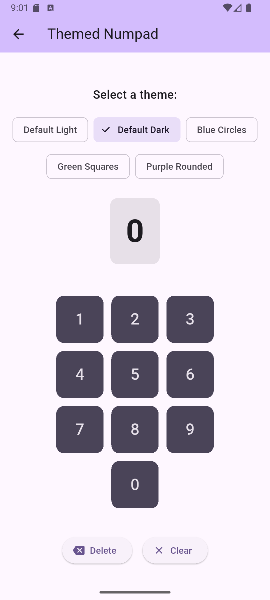
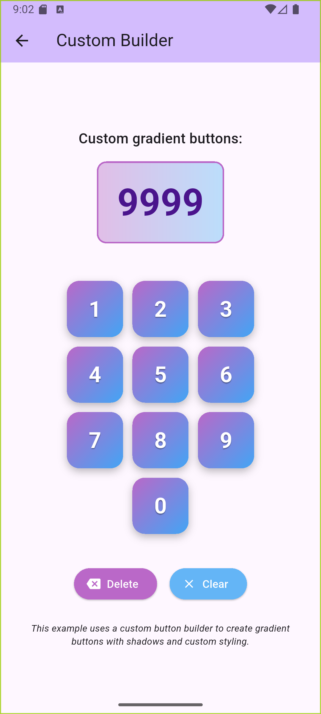

# numpad_kit

A fully customizable and themeable numeric keypad widget for Flutter that works seamlessly across all platforms (Android, iOS, macOS, Windows, Linux, and Web).

[](https://pub.dev/packages/numpad_kit)
[](https://opensource.org/licenses/MIT)

## Screenshots

<p align="center">
  
  
  
</p>

## Features

- 🎨 **Fully Customizable** - Change colors, sizes, shapes, and animations
- 🎯 **Controller-Based** - Manage state with `NumpadController`
- ⌨️ **Keyboard Support** - Physical keyboard input on web/desktop
- 📱 **Cross-Platform** - Works on all Flutter platforms
- 🔧 **Custom Builders** - Use your own button widgets
- ♿ **Accessible** - Meets accessibility guidelines
- 🌗 **Theme Support** - Built-in light and dark themes
- ➕ **Extra Buttons** - Optional customizable buttons

## Installation

Add this to your package's `pubspec.yaml` file:

```yaml
dependencies:
  numpad_kit: ^0.0.1
```

Then run:

```bash
flutter pub get
```

## Quick Start

```dart
import 'package:flutter/material.dart';
import 'package:numpad_kit/numpad_kit.dart';

class MyApp extends StatelessWidget {
  @override
  Widget build(BuildContext context) {
    return MaterialApp(
      home: Scaffold(
        body: Center(
          child: Numpad(
            controller: NumpadController(
              onInput: (value) => print('Input: $value'),
              onSubmit: (value) => print('Submitted: $value'),
            ),
          ),
        ),
      ),
    );
  }
}
```

## Usage

### Basic Numpad

```dart
final controller = NumpadController(
  maxLength: 6,
  onInput: (value) {
    print('Current value: $value');
  },
  onDelete: () {
    print('Delete pressed');
  },
  onClear: () {
    print('Clear pressed');
  },
  onSubmit: (value) {
    print('Submitted: $value');
  },
);

Numpad(controller: controller)
```

### Custom Theme

```dart
NumpadTheme(
  data: NumpadThemeData(
    buttonColor: Colors.blue,
    buttonTextColor: Colors.white,
    buttonShape: NumpadButtonShape.circle,
    buttonSize: 80.0,
    spacing: 16.0,
  ),
  child: Numpad(controller: controller),
)
```

### Using Built-in Themes

```dart
// Light theme
NumpadTheme(
  data: NumpadThemeData.light(),
  child: Numpad(controller: controller),
)

// Dark theme
NumpadTheme(
  data: NumpadThemeData.dark(),
  child: Numpad(controller: controller),
)
```

### Extra Buttons

Add optional buttons beside the "0" button:

```dart
Numpad(
  controller: controller,
  showLeftExtraButton: true,
  leftExtraButton: Icon(Icons.backspace),
  onLeftExtraButton: () => controller.deleteDigit(),
  showRightExtraButton: true,
  rightExtraButton: Icon(Icons.check),
  onRightExtraButton: () => controller.submit(),
)
```

### Custom Button Builder

Create completely custom button widgets:

```dart
Numpad(
  controller: controller,
  buttonBuilder: (context, value, onPressed, isEnabled) {
    return ElevatedButton(
      onPressed: isEnabled ? onPressed : null,
      style: ElevatedButton.styleFrom(
        shape: CircleBorder(),
        padding: EdgeInsets.all(20),
      ),
      child: Text(
        value,
        style: TextStyle(fontSize: 24),
      ),
    );
  },
)
```

### Keyboard Input

The numpad automatically supports keyboard input on web and desktop platforms:

- **0-9**: Enter digits
- **Backspace**: Delete last digit
- **Enter**: Submit
- **Escape**: Clear all

To disable keyboard input:

```dart
Numpad(
  controller: controller,
  enableKeyboardInput: false,
)
```

## NumpadController

The `NumpadController` manages the numpad's state and provides callbacks:

### Properties

- `value` - Current input value as a string
- `length` - Length of current value
- `isEmpty` - Whether value is empty
- `isNotEmpty` - Whether value is not empty

### Methods

- `addDigit(String digit)` - Add a digit to the value
- `deleteDigit()` - Remove the last digit
- `clear()` - Clear all digits
- `submit()` - Submit the current value
- `setValue(String value)` - Set value programmatically

### Callbacks

- `onInput(String value)` - Called when a digit is added
- `onDelete()` - Called when delete is triggered
- `onClear()` - Called when clear is triggered
- `onSubmit(String value)` - Called when submit is triggered

## NumpadThemeData

Customize every aspect of the numpad's appearance:

### Colors

- `backgroundColor` - Background color of numpad
- `buttonColor` - Default button color
- `buttonTextColor` - Button text color
- `buttonBorderColor` - Button border color
- `buttonHoverColor` - Button color on hover (web/desktop)
- `buttonPressedColor` - Button color when pressed
- `disabledButtonColor` - Disabled button color
- `disabledTextColor` - Disabled button text color

### Dimensions

- `buttonSize` - Size of each button (width and height)
- `spacing` - Spacing between buttons
- `buttonPadding` - Padding inside buttons
- `numpadPadding` - Padding around entire numpad

### Shape

- `buttonShape` - Shape of buttons (circle, square, roundedSquare)
- `borderRadius` - Border radius for rounded buttons
- `borderWidth` - Width of button borders

### Typography

- `textStyle` - Text style for button labels

### Animation

- `animationDuration` - Duration of button animations
- `animationCurve` - Curve for button animations
- `pressedScale` - Scale factor when pressed (0.0 to 1.0)

### Shadows

- `shadows` - List of box shadows for buttons

## Button Shapes

Three built-in button shapes:

```dart
NumpadButtonShape.circle        // Circular buttons
NumpadButtonShape.square        // Square buttons with sharp corners
NumpadButtonShape.roundedSquare // Square buttons with rounded corners
```

## Platform Support

| Platform | Supported | Keyboard Input |
|----------|-----------|----------------|
| Android  | ✅        | ❌             |
| iOS      | ✅        | ❌             |
| Web      | ✅        | ✅             |
| macOS    | ✅        | ✅             |
| Windows  | ✅        | ✅             |
| Linux    | ✅        | ✅             |

## Example App

Check out the [example](example/) directory for a complete demo app showcasing:

- Basic numpad usage
- Custom themes
- Extra buttons
- Custom button builders

To run the example:

```bash
cd example
flutter run
```

## Accessibility

The numpad follows accessibility best practices:

- Minimum touch target size of 48x48 logical pixels
- Semantic labels for screen readers
- Keyboard navigation support
- Sufficient color contrast ratios

## Contributing

Contributions are welcome! Please feel free to submit a Pull Request.

## License

This project is licensed under the MIT License - see the [LICENSE](LICENSE) file for details.

## Author

Created with ❤️ by the Flutter community

## Changelog

See [CHANGELOG.md](CHANGELOG.md) for a list of changes.
